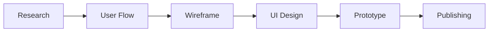

# CHUL O KWON

### UI/UX Designer · Web Designer · Publisher

사용자의 흐름을 이해하고,  
디자인에서 웹 구현까지 연결되는 경험을 고민합니다.

`UI/UX Design` · `Web Design` · `Responsive Web` · `Figma` · `HTML` · `CSS` · `JavaScript`

---

## About Me

- UI/UX 디자인 및 웹디자인 학습
- 사용자 중심 인터페이스 설계 관심
- 웹 퍼블리싱 기반의 구현 가능한 디자인 지향
- 반응형 웹 및 디자인 시스템 학습 중

---

## Design Process

---

## Tech Stack

### Design

### Web

### Tools

---

## Interested In

- Design System
- Responsive Web
- Web Accessibility
- Interaction Design
- UI Publishing

---

## Contact

- Portfolio : 준비 중
- GitHub : https://github.com/appleking7523
- Email : your-email@example.com
